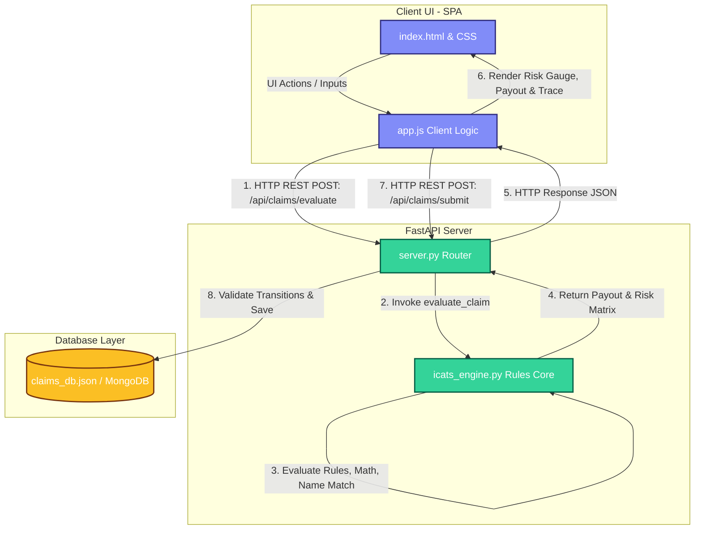

# Insurance Claim Assistance and Tracking System (ICATS)

**ICATS** is a rule-based **Decision Intelligence System** that translates statutory regulations (such as the Insurance Act, 1938) and compliance workflows into a digital claims validation pipeline. 

Designed for banks (intermediaries) and insurance assessors (underwriters), ICATS replaces legacy manual claim triage with a deterministic, auditable, and explainable decision framework.

---

## 1. About the Application

Settling life insurance claims is traditionally slow, error-prone, and heavily audited. When a policyholder passes away, their nominee submits a claim file. In the background, insurers must review complex exclusions, verify identities across systems, compute payouts for lapsed policies, and maintain strict timeline records.

ICATS digitalizes this sequence:
* **For Claimants/Bank Intermediaries:** It offers a step-by-step intake wizard, checks for correct documentation dynamically, and generates notary-ready name affidavits if bank mismatches occur.
* **For Insurer Assessors:** It displays a risk dashboard, calculates regulatory paid-up values, checks for medical fraud, and outputs a complete monospace rules execution trace detailing exactly *why* a claim should be Approved, Rejected, Audited, or Queried.

---

## 2. System Architecture & Claims Pipeline

The system is designed as a lightweight, single-page application (SPA) backed by a Python FastAPI server and an embedded rules core.



### The Settlement Pipeline:
1. **Intake Evaluation:** Customer inputs data in the UI. The backend `/api/claims/evaluate` endpoint evaluates the rules matrix and calculates initial risk scores.
2. **State Transition Check:** When a claimant submits, the backend verifies that the transition is valid according to the state machine logic (`DRAFT -> SUBMITTED`).
3. **Assessor Triaging:** The underwriter logs in, reviews the claimant dossier (with masked Aadhaar numbers for privacy), audits the rules execution logs, and pushes a decision.
4. **Disbursal Settlement:** If approved, the system generates a bank disbursal certificate. If queried, it loops back to the branch client: `QUERY_RAISED -> RESUBMITTED -> UNDER_REVIEW`.

---

## 3. Core Functionalities & Problem Resolutions

### Step 1: Dynamic Intake & Document Compliance Checklists
* **How it resolves the problem:** Accidental deaths require police documents (FIR, Post-Mortem Reports), while natural deaths require clinical summaries. Rather than overwhelming claimants with documentation lists, the rules engine dynamically updates the required checklist based on the cause of death. If an early natural claim is flagged, it automatically requests hospital case files.
* **Tech Stack:** Javascript ([app.js](file:///c:/Users/sriram/Desktop/Internship/app.js)) rendering DOM updates, and Python ([icats_engine.py](file:///c:/Users/sriram/Desktop/Internship/icats_engine.py)) running doc type checks.

### Step 2: Token-Sorted Levenshtein Fuzzy Name Auditing
* **How it resolves the problem:** Nominee names in policy contracts (e.g., `"Sunita Devi"`) often differ from the bank account cheque name (e.g., `"Sunita Kumar"` or `"Sunita D."`). This causes bank transfer rejections. ICATS strips common titles, sorts name tokens alphabetically (matching name inversions like `"Ramesh Kumar"` vs `"Kumar Ramesh"`), and calculates edit-distance similarity. If it fails the matching threshold, it auto-generates a notarization-ready "One and the Same Person" affidavit for the claimant.
* **Tech Stack:** Python custom similarity logic ([icats_engine.py](file:///c:/Users/sriram/Desktop/Internship/icats_engine.py)) and browser-based printing models.

### Step 3: Statutory Non-Forfeiture Payouts (Section 113)
* **How it resolves the problem:** Lapsed policies usually payout zero. However, under Section 113 of the Insurance Act, if premiums were paid for at least 3 years, the policy legally acquires a Reduced Paid-Up status. The system detects policy lapses, verifies eligibility, and automatically calculates the statutory payout amount:
  $$\text{Payout} = \left(\frac{\text{Premiums Paid Years}}{\text{Premium Paying Term}}\right) \times \text{Sum Assured}$$
* **Tech Stack:** Python math operations in the engine core.

### Step 4: Section 45 Medical Fraud & Risk Modifiers
* **How it resolves the problem:** Insurers must audit deaths occurring within 3 years of policy commencement to prevent pre-existing health fraud. The engine calculates policy age and flags early claims. If hospital case files reveal chronic ICD-10 medical codes (such as `N18.9` for kidney failure), it applies a +30 risk modifier. An aggregate risk score above 70 automatically overrides decisions and rejects the claim.
* **Tech Stack:** Date calculations using python `datetime` and risk-matrix weight scoring arrays.

### Step 5: Explainable Rules Execution Trace Logs
* **How it resolves the problem:** Traditional automated systems operate as black boxes, while manual underwriting takes months. ICATS outputs a step-by-step monospace console log detailing exactly which rules were evaluated, which failed, and the confidence level of the decision. This transparency builds underwriter trust and speeds up audits.
* **Tech Stack:** Monospace CSS container styling, backend log trace arrays.

### Step 6: Lifecycle State Machine Audit Trail
* **How it resolves the problem:** To comply with IRDAI timeline audits and prevent invalid status changes, the backend implements a state validator. Every lifecycle transition is recorded in a date-stamped, role-signed `state_history` array, preventing unauthorized approval overrides.
* **Tech Stack:** FastAPI state machine routing in [server.py](file:///c:/Users/sriram/Desktop/Internship/server.py).

---

## 4. How to Run & Verify the Codebase

### Prerequisites:
* Python 3.10 or higher.
* Chrome, Edge, or Safari browser.

### 1. Start the FastAPI Application
From your terminal, activate your virtual environment and run the server:
```powershell
python server.py
```
The application will start in reload mode at `http://127.0.0.1:8000`.

### 2. Run the Test Suite
The TDD test runner verifies all Ombsudman scenarios and combinatorial edge cases. Run it using:
```powershell
python tests/test_icats.py
```

### 3. Log in to the Application
Open `http://127.0.0.1:8000` in your browser. Use the top credentials helper to test different roles:
* **Primary Claimant:** Log in as `nominee@icats.in` (Password: `nominee`). Select a case, run the claimant autopilot, and submit.
* **Bank Intermediary:** Log in as `agent@sbi.co.in` (Password: `bankagent`). View branch claims and execute name affidavits.
* **Insurer Assessor:** Log in as `assessor@lic.co.in` (Password: `assessor`). Triages submitted claims and inspects the live rules trace logs.
